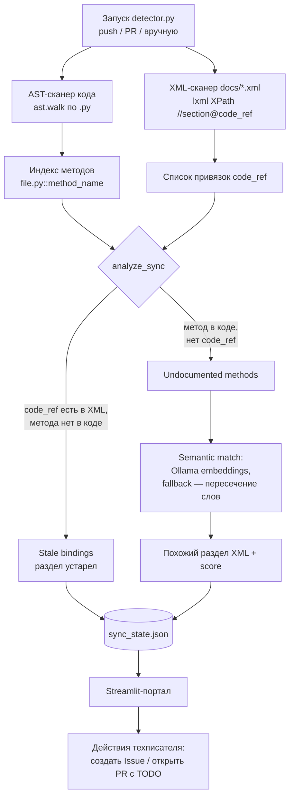

# git-doc-sync-agent

Doc-as-Code copilot: находит рассинхронизацию между кодом (Python/AST) и
документацией (DocBook XML / Markdown с `code_ref`), подсвечивает
устаревшие разделы в Streamlit-портале и помогает завести Issue или PR
с черновиком правки.

## Компоненты

- `detector.py` — AST-детектив: парсит изменения в коде и сверяет со
  ссылками `code_ref` в документации, обновляет `sync_state.json`.
- `streamlit_app.py` — портал техписателя: статусы разделов, действия
  «создать Issue» / «сгенерировать PR».
- `github_reporter.py` — создание GitHub Issue по устаревшему разделу.
- `git_pr_manager.py` — создание ветки, вставка TODO в XML, открытие PR.
- `config.py` — настройки через `.env` (см. переменные ниже).
- `docs/` — тестовая документация для self-monitoring (`installation_guide.xml`,
  `admin_guide.xml`, `writer_manual.md`).
- `.github/workflows/doc_sync_check.yml` — CI-проверка синхронизации
  при push/PR в `main`.

## Как это работает



1. `detector.py` парсит код через `ast` и документацию через `lxml` независимо друг от друга.
2. Раздел XML с `code_ref="file.py::method"` считается устаревшим (**stale**), если такого метода уже нет в коде.
3. Метод без обратной ссылки из XML попадает в **undocumented** — для него ищется семантически похожий раздел (эмбеддинги Ollama, при недоступности — пересечение слов).
4. Результат пишется в `sync_state.json` и рендерится в Streamlit-портале с бейджами статусов.
5. CI (`doc_sync_check.yml`) гоняет `detector.py` на каждый push/PR в `main`.

> **Статус:** создание GitHub Issue и PR с TODO-разметкой из UI реализованы
> (`github_reporter.py`, `git_pr_manager.py` — PyGithub, требуется
> `GITHUB_TOKEN`).

## Установка

```bash
pip install -r requirements.txt
cp .env.example .env  # заполнить переменные
python detector.py
streamlit run streamlit_app.py
```

## Переменные окружения (`.env`)

| Переменная | Назначение | По умолчанию |
|---|---|---|
| `GIT_REPO_PATH` | путь к репозиторию с кодом | `./` |
| `GIT_DEFAULT_BRANCH` | ветка по умолчанию | `main` |
| `GITHUB_TOKEN` | токен для PyGithub | — |
| `GITHUB_REPO` | `owner/repo` | `Ssazurov/git-doc-sync-agent` |
| `DOCS_DIR` | папка документации | `./docs` |
| `SYNC_STATE_FILE` | файл статусов | `./db/sync_state.json` |
| `OLLAMA_HOST` | адрес локальной LLM (Qwen 2.5) | — |

Подробнее об архитектуре: [`docs/architecture.md`](docs/architecture.md).

## Лицензия

См. `LICENSE.md`.
