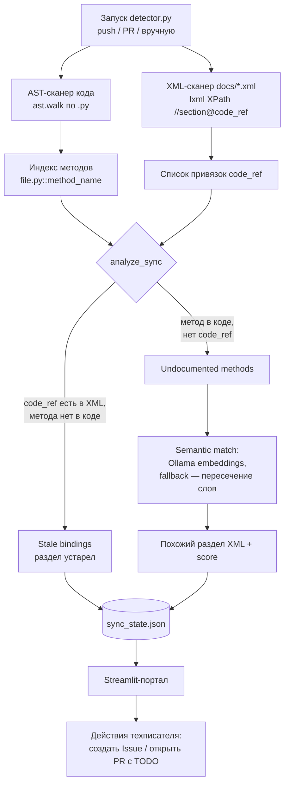

# git-doc-sync-agent 🤖📚

**Doc-as-Code copilot**, который следит, чтобы техническая документация не
расходилась с кодом. Разбирает Python-код через AST, сверяет со связями
`code_ref` в XML/DocBook-документации, находит устаревшие разделы и
недокументированный код, а по команде техписателя сам заводит GitHub Issue
или открывает Pull Request с TODO-разметкой.

Никакого «магического» LLM-агента, который тихо правит документацию за
человека: детерминированный анализ (AST + XPath) даёт список фактов,
Ollama-эмбеддинги — необязательная подсказка для маппинга, а решение и
финальный merge всегда остаются за техписателем.

## Проблема, которую решает проект

В большинстве команд документация — отдельная сущность: код меняется в PR,
а раздел мануала «Установка» продолжает ссылаться на давно удалённый
параметр. Инструмент делает связь между кодом и доками явной и проверяемой:
- Раздел XML помечается атрибутом `code_ref="file.py::method"`.
- Детектор на каждый прогон сверяет, существует ли ещё такой метод в коде.
- Расхождение — не догадка LLM, а факт: метод есть/метода нет.

## Как это работает



1. `detector.py` парсит код через `ast` и документацию через `lxml` независимо друг от друга.
2. Раздел с `code_ref="file.py::method"` считается **stale**, если такого метода уже нет в коде.
3. Метод без обратной ссылки из XML попадает в **undocumented** — для него ищется семантически похожий раздел (эмбеддинги Ollama, при недоступности — пересечение слов, порог 35%).
4. Результат пишется в `sync_state.json` и рендерится в Streamlit-портале.
5. Техписатель одной кнопкой заводит **GitHub Issue** (`github_reporter.py`) или **PR с TODO-комментарием** в самом XML (`git_pr_manager.py`) — целиком через GitHub API, без локального `git`.
6. CI (`doc_sync_check.yml`) гоняет `detector.py` на каждый push/PR в `main` и публикует отчёт.

## Self-monitoring

`docs/installation_guide.xml` и `docs/admin_guide.xml` — тестовая
документация самого проекта с `code_ref` на его же методы. Часть ссылок
намеренно устарела (например, `ingest.py::get_embedding_function` — файла
`ingest.py` в проекте нет), чтобы можно было сразу увидеть детектор в
действии без внешнего репозитория. Реальный пример находки —
[Issue #1](https://github.com/Ssazurov/git-doc-sync-agent/issues/1),
созданный самим `github_reporter.py`.

## Компоненты

| Файл | Роль |
|---|---|
| `detector.py` | AST-сканер кода + XPath-сканер XML, вычисляет stale/undocumented, сохраняет `sync_state.json` |
| `streamlit_app.py` | Портал техписателя: статусы разделов, метрики, кнопки действий |
| `github_reporter.py` | Создаёт GitHub Issue по устаревшему разделу (PyGithub) |
| `git_pr_manager.py` | Создаёт ветку, вставляет TODO в XML, открывает PR — через GitHub Contents/Git API |
| `config.py` | Настройки из `.env` |
| `docs/` | Тестовая self-monitoring документация |
| `.github/workflows/doc_sync_check.yml` | CI-проверка на push/PR в `main` |

## Технологии

`Python 3.10+` · `ast` (stdlib) · `lxml` (XPath) · `httpx` (async) ·
`Ollama` (embeddings, опционально) · `Streamlit` · `PyGithub` ·
`GitHub Actions`

## Установка и запуск

```bash
git clone https://github.com/Ssazurov/git-doc-sync-agent.git
cd git-doc-sync-agent
pip install -r requirements.txt
cp .env.example .env          # заполнить переменные (см. таблицу ниже)
python detector.py            # разовый анализ + краткий отчёт в консоль
streamlit run streamlit_app.py   # интерактивный портал техписателя
```

Для создания Issue/PR из UI нужен `GITHUB_TOKEN` с правами на репозиторий
из `GITHUB_REPO`. Семантический матчинг работает без Ollama (fallback на
пересечение слов), но качественнее — с локально поднятой Ollama.

## Переменные окружения (`.env`)

| Переменная | Назначение | По умолчанию |
|---|---|---|
| `GIT_REPO_PATH` | путь к репозиторию с кодом | `./` |
| `GIT_DEFAULT_BRANCH` | ветка по умолчанию | `main` |
| `GITHUB_TOKEN` | токен для PyGithub (создание Issue/PR) | — |
| `GITHUB_REPO` | `owner/repo` | `Ssazurov/git-doc-sync-agent` |
| `DOCS_DIR` | папка документации | `./docs` |
| `SYNC_STATE_FILE` | файл со статусами (генерируется) | `./db/sync_state.json` |
| `OLLAMA_HOST` | адрес локальной LLM для эмбеддингов | — |
| `OLLAMA_EMBED_MODEL` | модель эмбеддингов | `nomic-embed-text` |

Подробнее об архитектуре и что уже реализовано, а что в планах:
[`docs/architecture.md`](docs/architecture.md). Инструкция для техписателя
по работе с порталом: [`docs/writer_manual.md`](docs/writer_manual.md).

## Известные ограничения

- Детектор сравнивает *текущее* состояние кода и доков, а не diff между
  коммитами — это не история изменений, а снимок расхождений на момент запуска.
- Семантический матчинг — вспомогательная подсказка (эмбеддинги/пересечение
  слов), не гарантия точного соответствия; решение всегда за человеком.
- Мультиагентного оркестратора (LangGraph и т.п.) нет и не планируется —
  вся логика синхронный/асинхронный Python в `DocSyncDetector`.

## Лицензия

См. [`LICENSE.md`](LICENSE.md).
