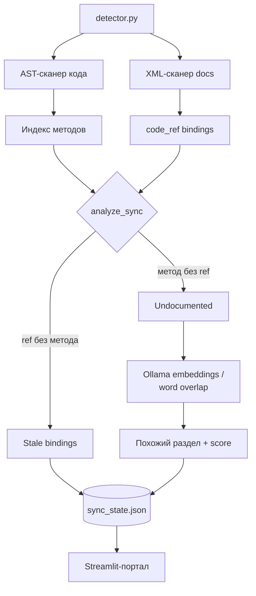

# Архитектура git-doc-sync-agent

## Идея

Doc-as-Code copilot: код и документация продукта связаны через
`code_ref` в XML-разделах. Агент следит, чтобы документация не
устаревала при изменениях кода, и подсвечивает расхождения
техписателю в отдельном портале.

## Компоненты (как реализовано сейчас)

| Компонент | Инструменты | Роль |
|---|---|---|
| AST-сканер | `ast` (stdlib) | Индексирует все функции/методы в `.py`-файлах: `file.py::method_name` |
| XML-навигатор | `lxml` (XPath) | Читает `docs/*.xml`, находит `<section code_ref="...">` |
| Semantic matcher | `httpx` → Ollama embeddings | Для недокументированного метода ищет похожий раздел XML; при недоступности Ollama — fallback на пересечение слов |
| Портал | Streamlit | Дашборд статусов, кнопки действий |
| CI | GitHub Actions | Прогоняет `detector.py` на push/PR в `main` |

## Поток данных

## Хранение состояния

Единственный источник правды между запусками — `sync_state.json`
(путь настраивается `SYNC_STATE_FILE`). Файл перезаписывается
каждым запуском `detector.py`; Git-историю решений (что уже
поправлено) он не хранит.

## Что реализовано, а что — план

**Реализовано:**
- AST-индексация методов, XML-парсинг привязок
- Определение stale/undocumented
- Semantic matching через Ollama embeddings с текстовым fallback
- Streamlit-дашборд с бейджами и метриками
- CI-проверка синхронизации
- Создание GitHub Issue по stale-разделу через `github_reporter.py`
  (PyGithub, требует `GITHUB_TOKEN`/`GITHUB_REPO` в `.env`)
- Создание ветки + вставка TODO-комментария в XML + открытие PR через
  `git_pr_manager.py` (GitHub Contents/Git API, без локального git-клиента)

**Не реализовано (задел под будущее):**
- Мультиагентный оркестратор (LangGraph) — не используется;
  вся логика — синхронный/асинхронный код в `DocSyncDetector`.
- Автоматический git diff по коммитам — детектор сравнивает
  текущее состояние кода/доков, а не diff между коммитами.

## Git-flow (реализовано)

Агент не пишет в `main` напрямую: `git_pr_manager.py` создаёт ветку
`docs-sync/patch-<section_id>` через Git API, вставляет TODO-комментарий
в XML, коммитит через Contents API и открывает Pull Request. Слияние —
вручную техписателем.

## Self-monitoring

`docs/installation_guide.xml` и `docs/admin_guide.xml` — тестовая
документация самого проекта, с `code_ref` на его же методы:
удобно для демонстрации и проверки детектора без внешнего репозитория.
